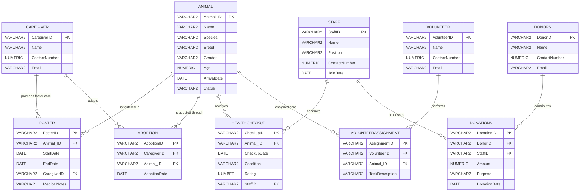

# Animalia — Animal Sanctuary Database Management System

[](https://www.oracle.com/database/)
[](https://en.wikipedia.org/wiki/Relational_database)
[](#)

A comprehensive relational database solution engineered in **Oracle SQL** to centralize operations, medical health tracking, volunteer coordination, foster care, adoptions, and donor contributions for an animal sanctuary and rescue organization.

---

## 📖 Project Overview

Animal shelters and sanctuaries manage complex, interconnected operational workflows across rescue intake, medical evaluations, temporary foster homes, permanent adoptions, volunteer assignments, and financial fundraising.

**Animalia** replaces error-prone spreadsheet logs with a robust, normalized 3NF Oracle relational database that:
- Guarantees data integrity through foreign keys, check constraints, and cascading rules.
- Centralizes medical histories, staff assignments, and caregiver records.
- Provides real-time operational reports for sanctuary administrators.

---

## ✨ Key Features & Business Rules

- **🐾 Animal Intake & Lifecycle Tracking:** Registers animals with unique IDs, species, breeds, arrival dates, and strict status constraints (`Available`, `Fostered`, `Adopted`, `Under Treatment`).
- **🩺 Health Checkups & Medical Logs:** Logs routine/post-treatment health evaluations with condition descriptions, 1–5 numerical ratings, and accountable veterinary staff.
- **🏡 Foster Care & Adoption Programs:** Tracks temporary foster intervals, medical notes, and official adoption placements with registered caregivers.
- **🤝 Volunteer Coordination:** Manages volunteer duties (e.g., exercise, grooming, cage maintenance, medical transport) linked to specific animals.
- **💰 Donors & Fund Processing:** Records financial contributions, specific funding purposes (e.g., Emergency Vet Fund, Shelter Renovation), and processing staff.

---

## 🗄️ Database Schema & Constraints

| Table Name | Primary Key | Foreign Keys | Key Integrity Constraints / Domain Checks |
| :--- | :--- | :--- | :--- |
| **`Animal`** | `Animal_ID` | — | `Gender IN ('Male','Female')`<br>`Age BETWEEN 0 AND 40`<br>`Status IN ('Available','Adopted','Fostered','Under Treatment')` |
| **`Caregiver`** | `CaregiverID` | — | Contact numbers & email records |
| **`Foster`** | `FosterID` | `Animal_ID`, `CaregiverID` | `EndDate >= StartDate` |
| **`Adoption`** | `AdoptionID` | `Animal_ID`, `CaregiverID` | Multi-table relational joins |
| **`Volunteer`** | `VolunteerID` | — | Volunteer personal directory |
| **`VolunteerAssignment`** | `AssignmentID` | `VolunteerID`, `Animal_ID` | Connects volunteers to animals & assigned tasks |
| **`Staff`** | `StaffID` | — | `Position IN ('Administrator', 'Caretaker', 'Vet Assistant')` |
| **`HealthCheckup`** | `CheckupID` | `Animal_ID`, `StaffID` | `Rating BETWEEN 1 AND 5` |
| **`Donors`** | `DonorID` | — | Donor registry |
| **`Donations`** | `DonationID` | `DonorID`, `StaffID` | `Amount > 0` |

---

## 🏛️ Entity-Relationship (ER) Architecture



---

## 🗄️ Database Schema & Data Dictionary

| Table Name | Primary Key | Foreign Keys | Key Constraints / Validation |
| :--- | :--- | :--- | :--- |
| **`Animal`** | `Animal_ID` | — | `Gender` IN ('Male', 'Female')<br>`Age` BETWEEN 0 AND 40<br>`Status` IN ('Available', 'Adopted', 'Fostered', 'Under Treatment') |
| **`Caregiver`** | `CaregiverID` | — | Contact details & email records |
| **`Foster`** | `FosterID` | `Animal_ID`, `CaregiverID` | `EndDate >= StartDate` |
| **`Adoption`** | `AdoptionID` | `Animal_ID`, `CaregiverID` | Tracks official adoption placements |
| **`Volunteer`** | `VolunteerID` | — | Contact info for sanctuary volunteers |
| **`VolunteerAssignment`** | `AssignmentID` | `VolunteerID`, `Animal_ID` | Connects volunteers to animals and specific care duties |
| **`Staff`** | `StaffID` | — | `Position` IN ('Administrator', 'Caretaker', 'Vet Assistant') |
| **`HealthCheckup`** | `CheckupID` | `Animal_ID`, `StaffID` | `Rating` BETWEEN 1 AND 5 |
| **`Donors`** | `DonorID` | — | Donor registry |
| **`Donations`** | `DonationID` | `DonorID`, `StaffID` | `Amount > 0` |

---

## 📊 Key Analytical Queries

### 1. Caregiver Adoption Overview (Including Non-Adopters)
*Uses a `LEFT JOIN` to retrieve all registered caregivers and any animal they have adopted.*
```sql
SELECT
    c.CaregiverID,
    c.Name AS Caregiver_Name,
    a.Animal_ID
FROM Caregiver c
LEFT JOIN Adoption ad ON c.CaregiverID = ad.CaregiverID
LEFT JOIN Animal a ON ad.Animal_ID = a.Animal_ID;
```

### 2. Health Checkup Frequency for Adopted Animals
*Calculates the total health examinations received per adopted animal.*
```sql
SELECT
    c.CaregiverID, 
    c.Name AS CaregiverName,
    a.Animal_ID,
    COUNT(CheckupID) AS TotalHealthChecks
FROM Caregiver c
JOIN Adoption ad ON c.CaregiverID = ad.CaregiverID
JOIN Animal a ON ad.Animal_ID = a.Animal_ID
LEFT JOIN HealthCheckup h ON a.Animal_ID = h.Animal_ID
GROUP BY c.CaregiverID, c.Name, a.Animal_ID
ORDER BY TotalHealthChecks DESC;
```

### 3. Recent Major Donors Analysis
*Identifies donors whose names begin with 'A' who donated after June 1, 2023.*
```sql
SELECT 
    d.DonorID, 
    d.Name,
    dn.DonationDate
FROM Donors d
JOIN Donations dn ON d.DonorID = dn.DonorID
WHERE d.Name LIKE 'A%'
  AND dn.DonationDate >= TO_DATE('2023-06-01', 'YYYY-MM-DD')
ORDER BY dn.DonationDate DESC;
```

### 4. Canine Exercise & Grooming Volunteer Assignments
*Finds active volunteers assigned to canine exercise or grooming tasks.*
```sql
SELECT DISTINCT 
    v.VolunteerID, 
    v.Name, 
    va.TaskDescription, 
    a.Name AS AnimalName, 
    a.Species
FROM Volunteer v
JOIN VolunteerAssignment va ON v.VolunteerID = va.VolunteerID
JOIN Animal a ON va.Animal_ID = a.Animal_ID
WHERE (va.TaskDescription = 'Exercise and walking' OR va.TaskDescription = 'Grooming sessions')
  AND a.Species = 'Dog';
```

### 5. Multi-Role Caregivers (Both Fosterers & Adopters)
*Identifies caregivers involved in both fostering and long-term adoption.*
```sql
SELECT CaregiverID, Name
FROM Caregiver
WHERE CaregiverID IN (SELECT CaregiverID FROM Foster)
  AND CaregiverID IN (SELECT CaregiverID FROM Adoption);
```

### 6. Long-Stay Sanctuary Residents with High Health Ratings
*Highlights animals residing in the sanctuary for over 1 year with an average health rating $\ge 4.0$.*
```sql
SELECT 
    a.Animal_ID, 
    a.Name,
    a.ArrivalDate,
    ROUND(AVG(h.Rating), 2) AS AvgRating
FROM Animal a
JOIN HealthCheckup h ON a.Animal_ID = h.Animal_ID
WHERE a.ArrivalDate <= ADD_MONTHS(SYSDATE, -12)
GROUP BY a.Animal_ID, a.Name, a.ArrivalDate
HAVING AVG(h.Rating) >= 4
ORDER BY AvgRating DESC;
```

---

## 🚀 Getting Started / How to Run

### Prerequisites
- An Oracle Database instance (e.g., Oracle Database Express Edition (XE), Oracle Autonomous Database, or Oracle Cloud Free Tier).
- A SQL client such as **Oracle SQL Developer**, **DBeaver**, **DataGrip**, or **Oracle Live SQL**.

### Execution Steps
1. Open your SQL client and connect to your Oracle Database schema.
2. Open the script file `animalia_script.sql`.
3. Execute the entire script as a script (or press `F5` in Oracle SQL Developer).
4. The script will:
   - Drop pre-existing tables cleanly with `CASCADE CONSTRAINTS`.
   - Recreate the normalized tables with primary keys, foreign keys, and validation checks.
   - Insert sample data for animals, staff, volunteers, caregivers, checkups, and donations.
   - Run the analytical verification and reporting queries.

---

## 📁 Project Structure

```text
├── animalia_script.sql    # Main Oracle SQL DDL, DML & Analytics Script
├── animalia_report.pdf    # Comprehensive Project Report & Documentation
└── README.md              # Project Overview and Documentation
```

---

## 📄 License & Attribution
Created for academic and practical database management studies. All sample data is simulated for demonstration purposes.
